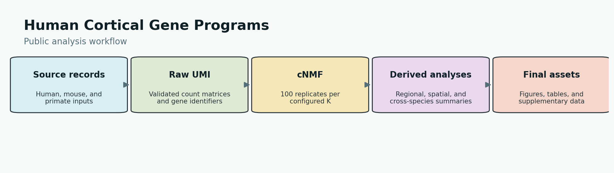

# Human Cortical Gene Programs

This repository contains the public analysis code for human cortical gene programs. It accepts externally obtained source files, produces derived analysis outputs, and builds final-numbered figures, tables, and supplementary data. No source data, generated backend service, or database implementation is included.



## Setup

```bash
conda env create -f environment/environment.yml
conda activate cortex-gene-program
Rscript environment/install_spatial_r_packages.R
cp config/paths.example.env config/paths.env
source environment/activate_paths.sh config/paths.env
bash environment/bootstrap_legacy_path_aliases.sh
```

Set `CORTEX_PROGRAM_DATA_ROOT` to the directory holding externally obtained inputs and `CORTEX_PROGRAM_RESULTS_ROOT` to an empty results directory. `environment/install_spatial_r_packages.R` installs SeuratDisk and spacexr from the exact commits stated in that script. `bootstrap_legacy_path_aliases.sh` creates two local generic aliases used by recovered historical scripts without inserting host paths into their source. Official records, access routes, input contracts, and current acquisition status are listed in `DATA_SOURCES.tsv`.

## Execution Order

1. Run the Jorstad downloader to retrieve and verify all five collection assets. Run `00_record_wei_stomics_manifest.py --output-tsv WEI_PROVIDER_FILES.tsv` to record the exact 69-file Wei provider contract; it identifies the aggregate `snRNA.h5ad` rather than merging the 23 cell-type H5AD records. `download=false` means manual provider access is required, not that the acquisition code is missing. Do not substitute an arbitrary single H5AD for the Jorstad manifest.
2. Build the human raw-UMI input with `01_data_processing/00_human_snrna_discovery/01_prepare_jorstad_wei.py`. For Macosko, `00_fetch_macosko_nemo_bag.sh --output-dir "$CORTEX_PROGRAM_DATA_ROOT/macosko_raw" --resolve-fetch` materializes and validates the public 25 TB Raw_10x BDBag, but it does not provide the reconstructed H5AD and metadata required by `00_fix_subset_mouse.py`; that 761,378-nucleus edge remains explicitly blocked.
3. Run human cNMF with `python 01_data_processing/00_human_snrna_discovery/02_run_cnmf_discovery.py --config config/cnmf_discovery.yaml`. The workflow performs exactly 100 replicates for every configured K, then exports the K=60 package-native spectra and consensus usages to `results/cnmf_human_k60/`.
4. Run spatial preprocessing in this order: `00_bin_spatial_counts.py`, `01_convert_h5ad_to_h5seurat.R`, `01_sct_program_scoring.R`, `02_prepare_rctd_objects.R`, and `02_run_rctd.R`. The H5Seurat conversion and RCTD object preparation make the public bin50-to-RCTD boundary explicit. Han section identifiers remain provider-selected; validate a user-acquired nonempty list with `03_validate_han_sections.py`. Chen snRNA files are obtained through manual provider access and can be checked with `00_validate_chen_provider_files.py`.
5. Run cross-species projection, association analyses, and null models in their numbered directories under `01_data_processing/`.
6. Use `python run_release.py --list` or `python run_release.py --asset Fig1` to inspect the original, asset-specific chain. `run_release.py` is a catalog and validator; it does not synthesize figures or copy arbitrary tables.

The final asset map is `final_asset_map.tsv`; it is the only numbering authority for Fig1-Fig8, FigS1-FigS10, TableS1-TableS6, and SuppData1-SuppData6. SuppData1, SuppData2, SuppData4, and SuppData6 include their renderer and the documented finalization step. Their source chains can rebuild the visible final form, but do not promise byte-identical PDFs across rendering environments or absent historical intermediate files.

## Code Archive Identity

This GitHub repository is the source-code home for the project. The archived software versions share concept DOI `10.5281/zenodo.21245200`; the initial archived snapshot is version DOI `10.5281/zenodo.21245201`. This `2026.07.11` code candidate has not yet been uploaded as a new Zenodo version, so it has no version-specific DOI. A new version DOI will be added after Zenodo creates that archive.

## Verification

```bash
bash SMOKE_TESTS.sh
```

The check validates syntax, mapped source chains, public-boundary rules, stable BLAKE2b seeding, cNMF export naming, and `SHA256SUMS`.
